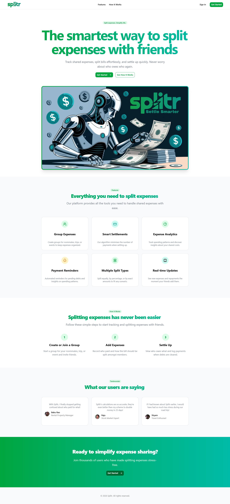

# Splitr - Smart Expense Splitting Made Simple

[](https://nextjs.org/)
[](https://convex.dev/)
[](https://clerk.com/)
[](https://www.typescriptlang.org/)
[](https://tailwindcss.com/)

Splitr is a modern, full-stack expense splitting application built for seamless group expense management. Track, split, and settle expenses with friends, family, or colleagues with real-time synchronization and intelligent balance calculations.



## Features

### 💰 Expense Management

- **Create Expenses**: Add expenses with custom categories and descriptions
- **Flexible Splitting**: Equal splits, percentage-based, or custom amounts
- **Real-time Updates**: Instant synchronization across all users
- **Category Tracking**: Organize expenses by type (food, transport, entertainment, etc.)

### 👥 Group Management

- **Create Groups**: Form groups for recurring expense sharing
- **Member Management**: Add/remove members with role-based permissions
- **Group Balances**: Automatic balance calculations and owed amounts
- **Group History**: Complete expense history with settlement tracking

### 💳 Settlement Tracking

- **Balance Overview**: See who owes what at a glance
- **Settlement Records**: Track all payments and settlements
- **Payment Reminders**: Automated email reminders for outstanding balances
- **Multi-currency Support**: Handle expenses in different currencies

### 🤖 AI-Powered Insights

- **Spending Analytics**: AI-generated insights into spending patterns
- **Monthly Reports**: Automated monthly spending summaries
- **Smart Recommendations**: Suggestions for better expense management

### 🔐 Security & Authentication

- **Secure Authentication**: Clerk-powered user management
- **Permission System**: Granular access controls
- **Data Encryption**: End-to-end encrypted sensitive data
- **Audit Logs**: Complete transaction history

## 🛠️ Tech Stack

### Frontend

- **Next.js 15**: React framework with App Router
- **TypeScript**: Type-safe development
- **Tailwind CSS**: Utility-first styling
- **Shadcn/ui**: Modern component library
- **React Hook Form**: Form management with validation
- **Zod**: Schema validation

### Backend

- **Convex**: Real-time database and backend-as-a-service
- **Clerk**: Authentication and user management
- **Inngest**: Background job processing
- **Gemini AI**: AI-powered insights

### Infrastructure

- **Vercel**: Deployment platform
- **Convex Cloud**: Database hosting
- **Inngest Cloud**: Job queue management

## 🚀 Quick Start

### Prerequisites

- Node.js 18+ and npm
- Convex account
- Clerk account
- Inngest account (for background jobs)

### Installation

1. **Clone the repository**

    ```bash
    git clone https://github.com/yourusername/splitr.git
    cd splitr
    ```

2. **Install dependencies**

    ```bash
    npm install
    ```

3. **Environment Setup**

    ```bash
    cp .env.local.example .env.local
    ```

    Fill in your environment variables:

    ```env
    # Convex
    NEXT_PUBLIC_CONVEX_URL=your_convex_url

    # Clerk
    NEXT_PUBLIC_CLERK_PUBLISHABLE_KEY=your_clerk_key
    CLERK_SECRET_KEY=your_clerk_secret

    # Inngest
    INNGEST_SIGNING_KEY=your_inngest_key

    # AI
    GEMINI_API_KEY=your_gemini_key
    ```

4. **Convex Setup**

    ```bash
    npx convex dev
    ```

5. **Run Development Server**

    ```bash
    npm run dev
    ```

    Open [http://localhost:3000](http://localhost:3000)

## 📖 Usage

### Creating a Group

1. Navigate to the Groups page
2. Click "Create Group"
3. Add group name, description, and members
4. Start adding expenses!

### Adding Expenses

1. Go to the Expenses page
2. Click "Add Expense"
3. Fill in amount, description, category
4. Select participants and split method
5. Save and watch balances update in real-time

### Settling Balances

1. Check your dashboard for outstanding balances
2. Use the Settlements page to record payments
3. Mark expenses as settled
4. Receive automated payment reminders

## 🏗️ Architecture


Splitr follows a modern full-stack architecture with real-time capabilities:

### Frontend Architecture
- **Next.js 15** with App Router for optimal performance
- **Client Components** for interactive features
- **Server Components** for SEO and initial page loads
- **Custom Hooks** for data fetching and state management

### Backend Architecture
- **Convex** as the real-time database and API layer
- **Clerk** for authentication and user management
- **Inngest** for background job processing and automation
- **Edge Runtime** for global performance

### Data Flow
1. **User Interaction** → Next.js Client Components
2. **API Calls** → Convex Queries/Mutations
3. **Real-time Updates** → Convex Subscriptions
4. **Background Jobs** → Inngest Functions
5. **Authentication** → Clerk Middleware

### Security Layers
- **Authentication**: Clerk JWT tokens
- **Authorization**: Convex permission checks
- **Input Validation**: Zod schemas
- **Data Encryption**: HTTPS + database encryption

## 📁 Project Structure

```
splitr/
├── app/                    # Next.js app directory
│   ├── (auth)/            # Authentication pages
│   ├── (main)/            # Main app pages
│   ├── api/               # API routes
│   └── globals.css        # Global styles
├── components/            # Reusable UI components
│   ├── ui/               # Shadcn/ui components
│   └── ...               # Custom components
├── convex/               # Convex backend functions
│   ├── schema.js         # Database schema
│   └── ...               # Query/mutation functions
├── hooks/                # Custom React hooks
├── lib/                  # Utility functions
│   └── inngest/          # Background job handlers
├── pics/                 # Project images and diagrams
└── public/               # Static assets
```

## 🔧 Development

### Available Scripts

```bash
npm run dev          # Start development server
npm run build        # Build for production
npm run start        # Start production server
npm run lint         # Run ESLint
npm run type-check   # Run TypeScript checks
```

### Code Quality

- **ESLint**: Configured for React/Next.js best practices
- **TypeScript**: Strict type checking enabled
- **Prettier**: Code formatting
- **Husky**: Pre-commit hooks for quality checks

### Testing

```bash
npm run test         # Run unit tests
npm run test:e2e     # Run end-to-end tests
```

## 🚀 Deployment

### Vercel Deployment

1. Connect your GitHub repository to Vercel
2. Add environment variables in Vercel dashboard
3. Deploy automatically on push to main branch

### Convex Deployment

```bash
npx convex deploy
```

### Environment Variables

Ensure all required environment variables are set in your deployment platform.

## 🤝 Contributing

We welcome contributions! Please see our [Contributing Guide](CONTRIBUTING.md) for details.

### Development Workflow

1. Fork the repository
2. Create a feature branch (`git checkout -b feature/amazing-feature`)
3. Make your changes
4. Run tests (`npm run test`)
5. Commit your changes (`git commit -m 'Add amazing feature'`)
6. Push to the branch (`git push origin feature/amazing-feature`)
7. Open a Pull Request

### Code Standards

- Follow the existing code style
- Write meaningful commit messages
- Add tests for new features
- Update documentation as needed

## 📊 API Documentation

### Convex Queries

- `api.dashboard.getUserGroups`: Get user's groups with balances
- `api.expenses.getGroupExpenses`: Get expenses for a group
- `api.settlements.getSettlementData`: Get settlement information

### Mutations

- `api.expenses.createExpense`: Create a new expense
- `api.groups.createGroup`: Create a new group
- `api.settlements.recordSettlement`: Record a settlement

## 🔒 Security

- **Authentication**: Clerk handles secure user authentication
- **Authorization**: Convex enforces data access permissions
- **Input Validation**: Zod schemas validate all user inputs
- **HTTPS Only**: All communications encrypted in production

## 📈 Performance

- **Real-time Updates**: Convex provides instant data synchronization
- **Optimized Queries**: Indexed database queries for fast lookups
- **Lazy Loading**: Components load data as needed
- **Caching**: Intelligent caching strategies implemented

## 🐛 Troubleshooting

### Common Issues

**Build fails with module not found**

```bash
npx convex codegen
npm run build
```

**Authentication issues**

- Check Clerk configuration
- Verify environment variables
- Clear browser cookies

**Database connection issues**

- Check Convex dashboard
- Verify deployment status
- Check network connectivity

## 📄 License

This project is licensed under the MIT License - see the [LICENSE](LICENSE) file for details.

## 🙏 Acknowledgments

- [Next.js](https://nextjs.org/) - The React framework
- [Convex](https://convex.dev/) - Real-time database
- [Clerk](https://clerk.com/) - Authentication
- [Inngest](https://inngest.com/) - Background jobs
- [Shadcn/ui](https://ui.shadcn.com/) - UI components

## 📞 Support

- **Issues**: [GitHub Issues](https://github.com/aridepai17/splitr/issues)
- **Discussions**: [GitHub Discussions](https://github.com/aridepai17/splitr/discussions)

---

Built with ❤️ by the [Advaith R Pai]((https://github.com/aridepai17/)
